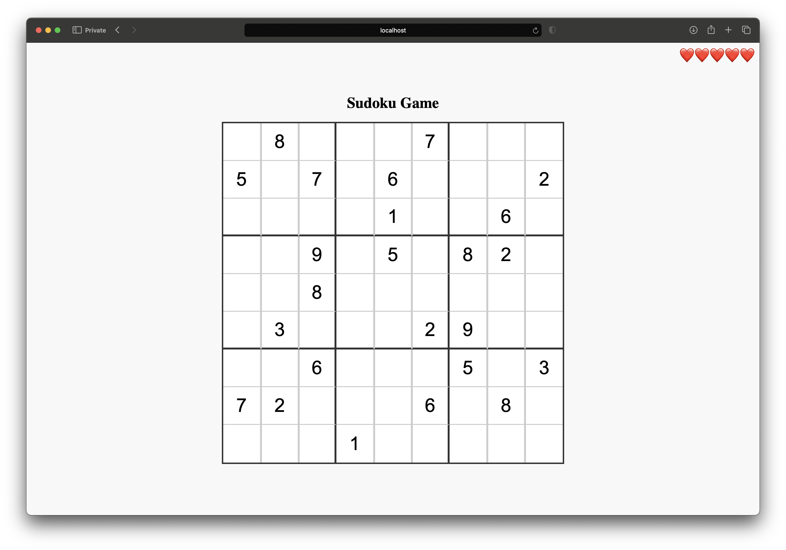
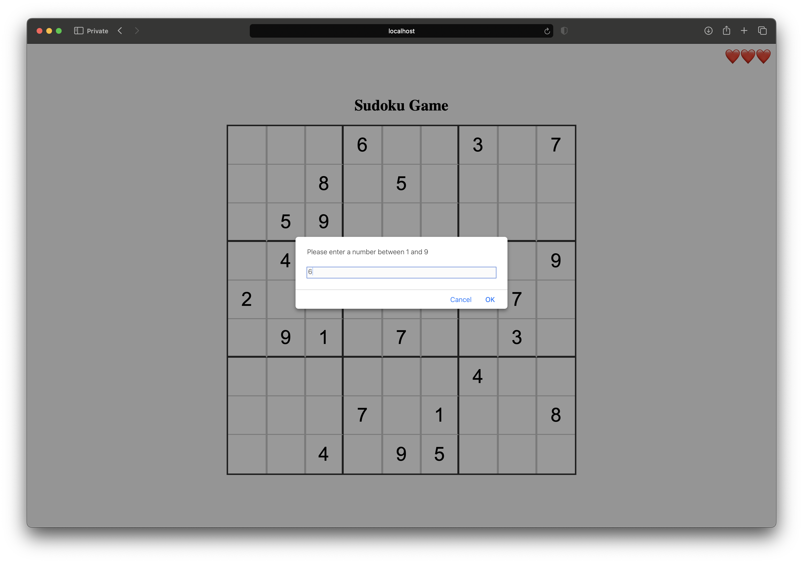
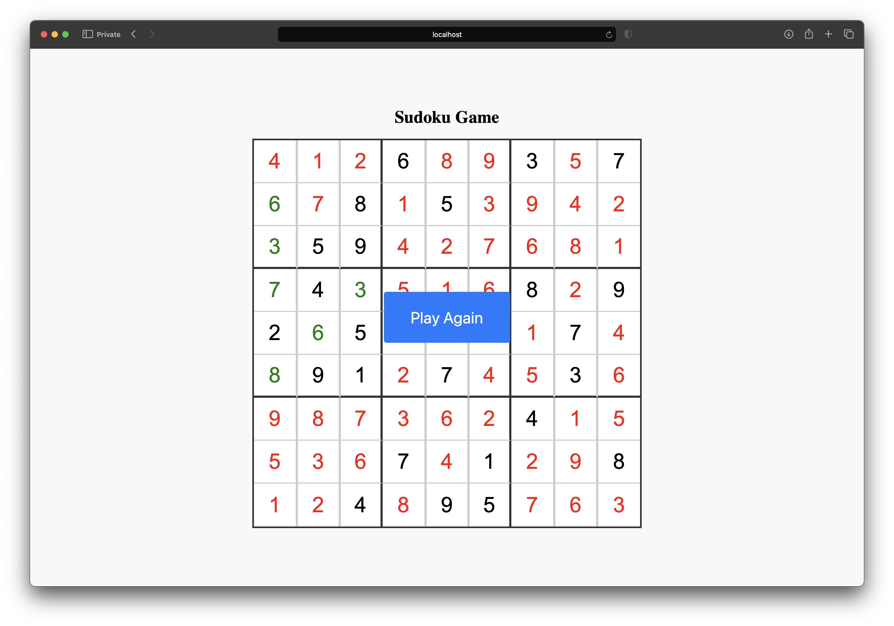

# Sudoku Puzzle Game



Welcome to Sudoku Puzzle Game! This repository contains a Sudoku game implemented with a Node.js backend and a JavaScript frontend.

## Features

- **Interactive Interface:** Enjoy a user-friendly interface for playing Sudoku puzzles.
- **Puzzle Generation:** Automatically generate new Sudoku puzzles with varying levels of difficulty.
- **Real-time Validation:** Validate your moves in real-time to ensure accuracy.
- **Solver Algorithm:** Get hints or solve the entire puzzle with the built-in solver algorithm.
- **Responsive Design:** Play the game seamlessly on both desktop and mobile devices.

## Getting Started

Follow these instructions to get a copy of the project up and running on your local machine.

### Prerequisites

- [Node.js](https://nodejs.org/) installed on your machine

### Installation

1. Clone the repository:

   ```bash
   git clone https://github.com/your-username/sudoku-puzzle.git
   ```

2. Navigate to the project directory:

   ```bash
   cd sudoku-puzzle
   ```

3. Install dependencies for both backend and frontend:

   ```bash
   cd backend
   npm install
   cd ../frontend
   npm install
   ```

### Usage

1. Start the backend server:

   ```bash
   cd ../backend
   npm start
   ```

2. Start the frontend development server:

   ```bash
   cd ../frontend
   npx http-server
   ```

3. Open your web browser and go to `http://localhost:8080` to play Sudoku!

## Screenshots




## License

This project is licensed under the MIT License - see the [LICENSE](MIT) file for details.
